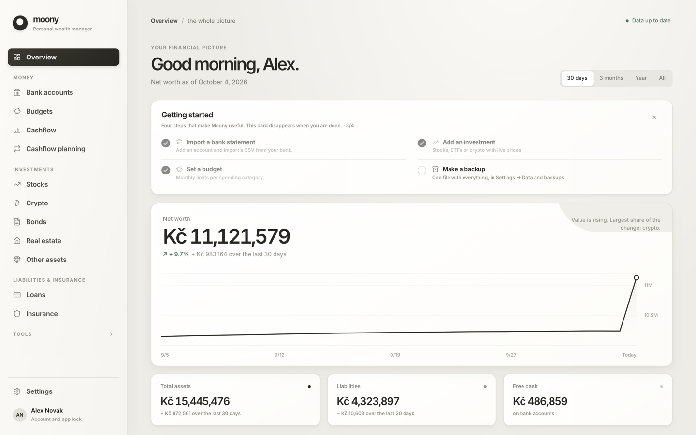
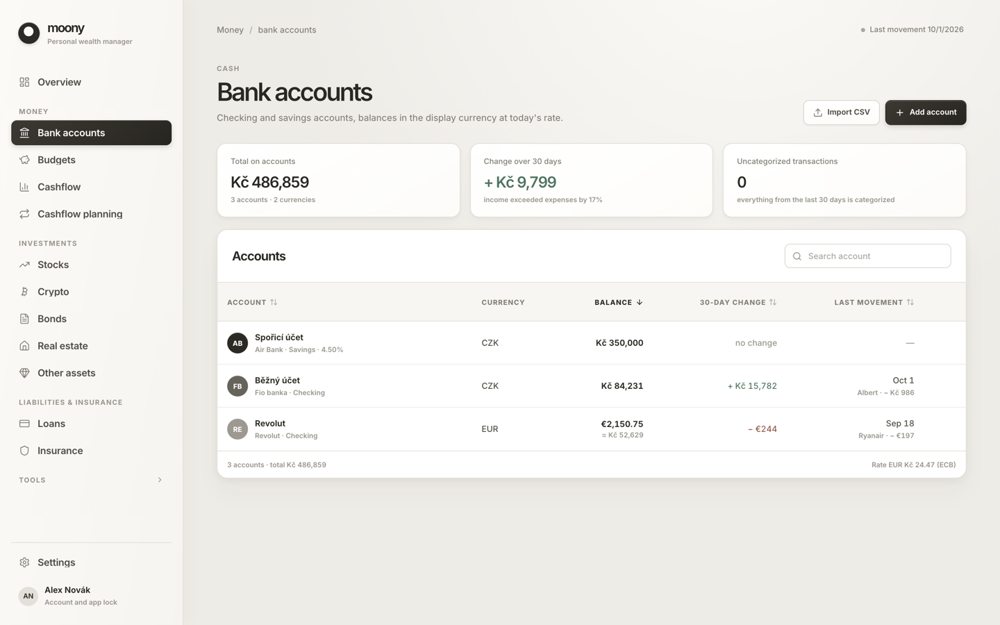
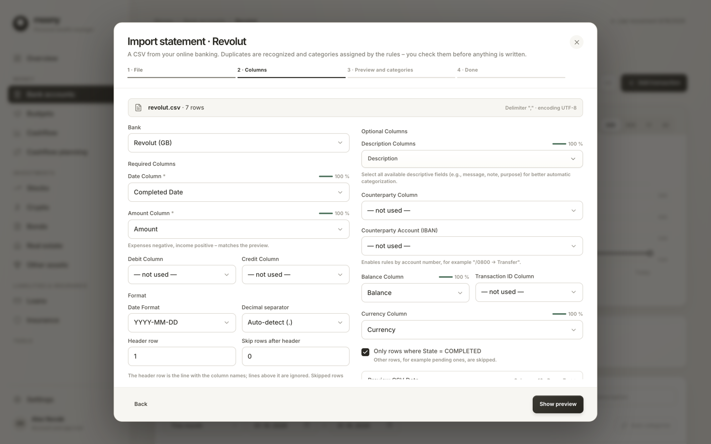
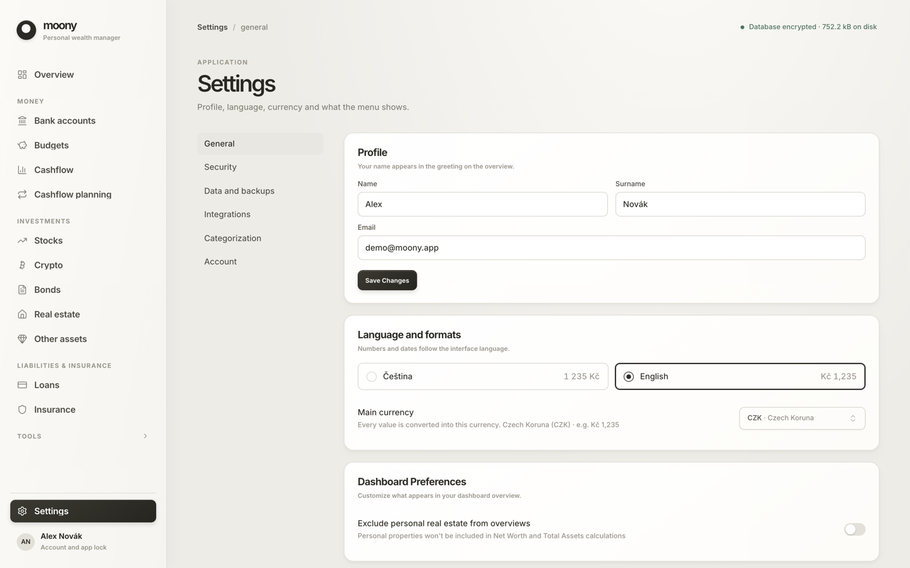

# Moony

<div align="center">

A privacy-focused personal finance app for your desktop, built with Tauri, React and Rust.

**Your financial records are stored only on your device, in an encrypted database.**

[](https://github.com/fiiles/Moony/actions/workflows/ci.yml)
[](https://github.com/fiiles/Moony/releases/latest)
[](./LICENSE)

</div>

Moony tracks your bank accounts, investments, crypto, bonds, real estate, loans and insurance
in one net-worth view, in English or Czech, in any of 40+ currencies. There is no account, no
cloud and no sync: everything lives in an AES-256 encrypted database on your computer.

## Screenshots

<p align="center">
  
</p>

<p align="center">
  
  
</p>

<p align="center">
  
</p>

The screenshots show the demo profile (synthetic data) — see [Demo data](#demo-data).

## Install

Download the installer for your system from the
[latest release](../../releases/latest) (all releases are listed on the
[Releases](../../releases) page).

> **Moony's installers are not code-signed yet.** Signing needs an Apple Developer Program
> membership and a Windows code-signing certificate, which the project does not have; it is
> planned (see [`docs/playbooks/release.md`](./docs/playbooks/release.md)). Until then macOS
> and Windows show a warning the first time you open the app. The app is not damaged — follow
> the steps below once. Updates inside the app are verified with the project's own signature
> either way.

### macOS

1. Download `Moony_<version>_aarch64.dmg` for Apple Silicon (M1 and newer) or
   `Moony_<version>_x64.dmg` for Intel Macs.
2. Open the `.dmg` and drag **Moony** into **Applications**.
3. The first launch may say *"Moony is damaged and can't be opened"* or *"cannot be opened
   because the developer cannot be verified"* (Gatekeeper). Do one of these:
   - In Terminal run `xattr -cr /Applications/Moony.app` (removes the download quarantine
     flag), then open Moony normally; or
   - Open **System Settings → Privacy & Security**, scroll to the *Security* section and click
     **Open Anyway** next to Moony; or
   - On macOS 14 and older: right-click (Control-click) Moony in Applications and choose
     **Open**, then confirm. This shortcut no longer works on macOS 15 and later.

### Windows

1. Download `Moony_<version>_x64-setup.exe` and run it.
2. Windows SmartScreen may show *"Windows protected your PC"*. Click **More info**, then
   **Run anyway**.
3. Moony needs the Microsoft Edge WebView2 runtime, which is preinstalled on Windows 10 and 11;
   the installer fetches it if it is missing.

### Linux

Builds are provided for x86_64.

- **AppImage:** `chmod +x Moony_<version>_amd64.AppImage && ./Moony_<version>_amd64.AppImage`
  (some distributions need `libfuse2` for AppImages).
- **Debian / Ubuntu:** `sudo apt install ./Moony_<version>_amd64.deb`
- **Fedora / openSUSE:** `sudo dnf install ./Moony-<version>-1.x86_64.rpm`

### First run

A short wizard asks for your display currency and country, a name and password, shows your
**recovery key** (save it — see [Data and backups](#data-and-backups)), lets you choose what to
track, and offers to add your first account and import a bank statement. The dashboard then
shows a *Getting started* checklist.

### Updating

After you unlock Moony it asks GitHub whether a newer version exists and offers a one-click
update (the download is verified against the project's public key before it is installed).
You can switch the automatic check off in Settings; see [PRIVACY.md](./PRIVACY.md).

## Features

### 📊 Dashboard & Overview
- **Net Worth Dashboard** - Total net worth across all asset classes, with a *Getting started* checklist for new profiles
- **Historical Tracking** - Net worth trends over time with interactive charts
- **Multi-currency** - 40+ currencies (every currency the ECB publishes plus common others); each account keeps its own currency and totals are shown in the one you choose. Rates are ECB reference rates (daily rates from the ECB, history via Frankfurter)

---

### 💰 Asset Management

- **🏛️ Bank Accounts** - Track checking and savings accounts with full transaction history
  - **CSV import with bank presets** - the file is recognised from its header row and mapped automatically: Revolut, Wise, N26, Fio, Česká spořitelna, Komerční banka, Air Bank, ČSOB, mBank, Raiffeisenbank, Moneta, Chase, Sparkasse, DKB, ING Germany and a generic UK debit/credit layout. Other files work through multilingual column detection with a parsed preview, decimal/date overrides, duplicate skipping and one-click undo of an import. New banks are one small JSON file — see [CONTRIBUTING.md](./CONTRIBUTING.md#adding-a-bank-preset)
  - Smart auto-categorization: your own rules, rules learned from your choices, and rule packs for many countries; manage categories in Settings
  - Transaction filtering and search
- **📈 Stock Investments** - Track stocks with live price updates
  - Price fetching via Yahoo Finance (no API key required); you can set a price by hand
  - Portfolio tagging system for organization
  - Performance analysis with gain/loss tracking
  - Dividend tracking
  - **Stock Monitor** - a watchlist with your own notes and target prices that never counts toward net worth
- **🪙 Cryptocurrency** - Monitor crypto holdings with CoinGecko integration (an API key is optional)
  - Price updates and transaction history
- **🏠 Real Estate** - Manage property portfolio
  - Photo galleries and document storage
  - Valuation tracking over time
  - Rental income, recurring costs, linked loans and insurance
- **📋 Bonds** - Monitor fixed-income investments
- **💎 Other Assets** - Manage miscellaneous assets (art, collectibles, vehicles, etc.)

---

### 💳 Liabilities & Insurance

- **💳 Loans** - Track liabilities and loan payments
- **🛡️ Insurance** - Keep track of insurance policies with document attachments

---

### 📊 Analytics & Reporting

- **🐷 Budgeting** - Category-based expense tracking with budget goals
  - Visual spending analysis by category
  - Monthly, quarterly, and yearly views
  - Budget limit tracking with visual indicators
- **📊 Cashflow Planning** - Plan and forecast personal and investment cashflows
- **📈 Portfolio Projection** - Project future net worth with customizable growth rates
- **🏷️ Stock Analysis** - Detailed stock portfolio analysis with tagging and grouping

---

### 🧮 Calculators

- **🧮 Annuity Calculator** - Calculate loan payments with amortization schedules
- **🏢 Rental Property Calculator** - Evaluate property investments with ROI analysis

---

### ⚙️ Settings & Customization

- **Language** - Full English and Czech interface; numbers, money and dates follow the language
- **Menu Customization** - Show/hide menu items based on your needs
- **Data and backups** - backup, restore, full export and a data-folder shortcut (below)
- **Security** - change your password, optional auto-lock when you are away
- **Updates** - built-in update notification with a switch for the automatic check

---

### 🤖 AI Assistant (MCP) — optional, for advanced users

Moony can serve your data to an AI assistant such as Claude over the Model Context Protocol. It
is **off by default**, runs only on your own computer, and needs the app to be unlocked.

- **Built-in MCP server** - Streamable HTTP at `http://127.0.0.1:41414/mcp` (port configurable) — no extra software to install
- **Token authentication** - Every request must carry a bearer token generated once and stored inside the encrypted database. Anyone with the token can read and modify that data — treat it like a password
- **Read tools and a small set of write tools** - portfolio, investments, crypto, banking, insurance, the stock watchlist and analytics can be read. Write tools create records (accounts, bonds, loans, properties, other assets, insurance policies) and bulk-import parsed statements and broker exports; category suggestions arrive as *pending* suggestions that you confirm in the app
- **Runs while unlocked** - Locking the app closes the port; unlocking reopens it with the same address and token, so client configs keep working
- **Your data goes to the AI client.** Whatever the client reads is processed by it — usually in its provider's cloud. Enable the server only for clients you trust

#### Setup

1. Open Moony → **Settings → Integrations** → enable **AI Assistant (MCP Server)**
2. Copy the ready-made config for your client from Settings:
   - **Claude Code:** `claude mcp add --transport http moony http://127.0.0.1:41414/mcp --header "Authorization: Bearer <token>"`
   - **Claude Desktop:** via the `mcp-remote` bridge (config shown in Settings; requires Node.js)
   - **Other clients:** HTTP transport (`"type": "http"`) with an `Authorization` header

Moony must be **running and unlocked** with MCP Server enabled for the integration to work.

## Privacy & Security

The full, checkable version is in **[PRIVACY.md](./PRIVACY.md)**; vulnerabilities go through
**[SECURITY.md](./SECURITY.md)**.

- **Local only** — all records are stored in an AES-256 encrypted SQLite database (SQLCipher) in your user profile. There is no account, no cloud and no sync.
- **What leaves your computer** — only what is needed for market data: the stock tickers, crypto IDs and currencies you track are sent to Yahoo Finance, CoinGecko and ECB/Frankfurter when prices are refreshed. Balances, amounts, names and documents are never sent. Moony works offline too; prices and rates just go stale.
- **Update check** — after you unlock, Moony asks GitHub Releases whether a newer version exists.
- **Optional analytics** — anonymous screen-view statistics (Aptabase), only with your consent, off by default, toggle in Settings. Only official release builds contain analytics.
- **Attachments** — documents and photos you attach are stored as plain files in the data folder (**not encrypted**); encrypting them is on the roadmap.
- **Password + recovery key** — the database key is protected by your password and, as a fallback, by a 24-character recovery key. Both unlock the same key files in the data folder; keep a backup of the whole folder. There is no backdoor: without the password and the recovery key nobody can open your data.

## Data and backups

Your data lives in one folder per user, named after the app identifier
`com.filipkral.moony`:

| OS | Data folder |
| --- | --- |
| macOS | `~/Library/Application Support/com.filipkral.moony/` |
| Windows | `%APPDATA%\com.filipkral.moony\` |
| Linux | `~/.local/share/com.filipkral.moony/` |

It holds the encrypted database (`moony.db`), the key files (`salt`, `key.enc`, `recovery.enc`)
and your attachments. **Settings → Data and backups** shows the exact path (with an *Open folder*
button) and offers:

- **Back up now** — one ZIP with a consistent snapshot of the database, the key files and the
  attachments. Keep it somewhere safe, for example an external drive or your own cloud storage.
- **Restore from backup** — replaces your data with a backup; your current data is moved to a
  `pre-restore-…` folder first, never deleted. Unlock afterwards with the password that belongs
  to the backup.
- **Export all data (JSON)** — an open-format dump of everything (unencrypted, handle with care).
- **Verify database** — an integrity check.

Save your **recovery key** when the app shows it. It is the only way to reset a forgotten
password, and it works only together with the key files in the data folder, so back up the
whole folder or use *Back up now*. Moony never uploads anything, so you are responsible for your
own copies.

## Demo data

To try Moony without entering anything — or to take screenshots — generate a demo profile
with realistic synthetic finances:

```bash
cd src-tauri
cargo run --bin seed_demo                    # writes ../demo-home/
cargo run --bin seed_demo -- --out <dir>     # or: MOONY_SEED_OUT=<dir> cargo run --bin seed_demo
```

The demo password is `demo1234`. The generator replaces whatever is in the target folder, so
never point it at a folder that holds real data. How to run the app against the demo profile on
macOS, Linux and Windows is described in [CONTRIBUTING.md](./CONTRIBUTING.md#demo-data).

## Tech Stack

### Frontend
- **React 19** with TypeScript
- **Vite** for fast development and building
- **TailwindCSS** for styling
- **shadcn/ui** components (Radix UI primitives)
- **TanStack Query** for data fetching and caching
- **Recharts** for data visualization
- **wouter** for routing
- **react-hook-form** + **zod** for form validation
- **Framer Motion** for animations
- **i18next** for English and Czech

### Backend
- **[Tauri 2](https://v2.tauri.app/)** - Cross-platform desktop app framework
- **Rust** - Backend logic and data processing
- **SQLite with SQLCipher** - Encrypted local database
- **reqwest** - HTTP client for external API calls
- **rmcp** - Embedded MCP server (Model Context Protocol)

## Build from source

Most people only need the [installers](#install). To build or develop Moony yourself, install
the prerequisites below.

### Prerequisites

#### All Platforms
- [Node.js](https://nodejs.org/) 22 or newer (CI uses Node 22) - JavaScript runtime
- [Rust](https://www.rust-lang.org/tools/install) (latest stable, via rustup) - Backend language
- The [Tauri 2 prerequisites](https://v2.tauri.app/start/prerequisites/) for your OS (summarized below)

---

#### Windows

1. **Install Rust**
   - Download and run the installer from [rustup.rs](https://win.rustup.rs/x86_64)
   - Follow the installation prompts
   - Restart your terminal after installation

2. **Install Microsoft C++ Build Tools** (required by Rust)
   - Download from [Visual Studio Build Tools](https://visualstudio.microsoft.com/visual-cpp-build-tools/)
   - During installation, select **"Desktop development with C++"** workload
   - This includes MSVC compiler and Windows SDK

3. **Install WebView2** (usually pre-installed on Windows 10/11)
   - If not present, download from [Microsoft Edge WebView2](https://developer.microsoft.com/en-us/microsoft-edge/webview2/)

4. **Install OpenSSL** (SQLCipher needs a crypto library; the release build uses a static one from vcpkg)
   ```powershell
   vcpkg install openssl:x64-windows-static-md
   $env:OPENSSL_DIR = "<your vcpkg root>\installed\x64-windows-static-md"
   $env:OPENSSL_STATIC = "1"
   ```

5. **Verify installation**
   ```powershell
   rustc --version
   cargo --version
   node --version
   ```

---

#### macOS

1. **Install Xcode Command Line Tools**
   ```bash
   xcode-select --install
   ```

2. **Install Rust**
   ```bash
   curl --proto '=https' --tlsv1.2 -sSf https://sh.rustup.rs | sh
   source $HOME/.cargo/env
   ```

3. **Verify installation**
   ```bash
   rustc --version
   cargo --version
   node --version
   ```

---

#### Linux (Ubuntu/Debian)

1. **Install system dependencies**
   ```bash
   sudo apt update
   sudo apt install libwebkit2gtk-4.1-dev build-essential curl wget file libxdo-dev libssl-dev libayatana-appindicator3-dev librsvg2-dev
   ```

2. **Install Rust**
   ```bash
   curl --proto '=https' --tlsv1.2 -sSf https://sh.rustup.rs | sh
   source $HOME/.cargo/env
   ```

3. **Verify installation**
   ```bash
   rustc --version
   cargo --version
   node --version
   ```

For other Linux distributions, see the [Tauri Linux prerequisites](https://v2.tauri.app/start/prerequisites/#linux).

### Getting Started

1. **Clone the repository**
   ```bash
   git clone https://github.com/fiiles/Moony.git
   cd Moony
   ```

2. **Install dependencies**
   ```bash
   npm install
   ```

3. **Run in development mode**
   ```bash
   npm run tauri dev
   ```

4. **Build for production**
   ```bash
   npm run tauri build
   ```

Builds from source contain no analytics unless you provide your own Aptabase key (see
`.env.example`). The checks to run before committing, the demo profile and the browser dev
bridge are described in [CONTRIBUTING.md](./CONTRIBUTING.md).

### Project Structure

```
Moony/
├── src/                    # React frontend
│   ├── components/         # UI components
│   ├── hooks/              # Custom React hooks
│   ├── i18n/               # Internationalization
│   ├── lib/                # Utilities and API client
│   ├── pages/              # Page components
│   └── utils/              # Helper functions
├── src-tauri/              # Rust backend
│   ├── src/
│   │   ├── commands/       # Tauri command handlers
│   │   ├── db/             # Database migrations and setup
│   │   ├── models/         # Data models
│   │   └── services/       # Business logic (incl. embedded MCP server)
│   ├── resources/          # Bank CSV presets and categorization rule packs
│   ├── tests/fixtures/     # Sample bank statements used by the preset tests
│   └── tauri.conf.json     # Tauri configuration
├── shared/                 # Shared types and utilities
├── docs/                   # Architecture, standards, ADRs, playbooks, design system, screenshots
├── scripts/                # Maintenance scripts (third-party licence inventory)
└── public/                 # Static assets
```

### Recommended IDE Setup

- [VS Code](https://code.visualstudio.com/)
- [Tauri Extension](https://marketplace.visualstudio.com/items?itemName=tauri-apps.tauri-vscode)
- [rust-analyzer](https://marketplace.visualstudio.com/items?itemName=rust-lang.rust-analyzer)
- [ESLint](https://marketplace.visualstudio.com/items?itemName=dbaeumer.vscode-eslint)

## Contributing and project documents

- [CONTRIBUTING.md](./CONTRIBUTING.md) — how the project is developed, quality gates, demo data, adding a bank preset
- [CODE_OF_CONDUCT.md](./CODE_OF_CONDUCT.md) — Contributor Covenant 2.1
- [CHANGELOG.md](./CHANGELOG.md) — what changed
- [SECURITY.md](./SECURITY.md) and [PRIVACY.md](./PRIVACY.md) — vulnerability reporting and what data goes where
- [`docs/`](./docs/) — architecture, standards, decisions and playbooks (including the [release playbook](./docs/playbooks/release.md))

## License

Copyright © 2024-2026 Filip Král

Moony is free software: you can redistribute it and/or modify it under the terms of the
**GNU Affero General Public License v3.0** as published by the Free Software Foundation.

- ✅ Free to use, study, modify, and share
- ✅ Forks and derivative works are allowed — including commercially
- ⚠️ **Copyleft:** anything you distribute (or make available over a network) that is based on
  Moony must be released in full under the AGPL-3.0 as well, with complete source code
- ❌ No closed-source or proprietary forks

Moony is distributed WITHOUT ANY WARRANTY; without even the implied warranty of
MERCHANTABILITY or FITNESS FOR A PARTICULAR PURPOSE.

See [LICENSE](./LICENSE) for the full text, or <https://www.gnu.org/licenses/agpl-3.0.html>.

The licences of the npm packages and Rust crates Moony is built from are inventoried in
[THIRD_PARTY_LICENSES.md](./THIRD_PARTY_LICENSES.md) (regenerate with `npm run licenses`).

Want to use Moony under terms other than the AGPL? Contact the copyright holder about a
commercial license.

---

<div align="center">
Made with ❤️ using Tauri + React + Rust
</div>
